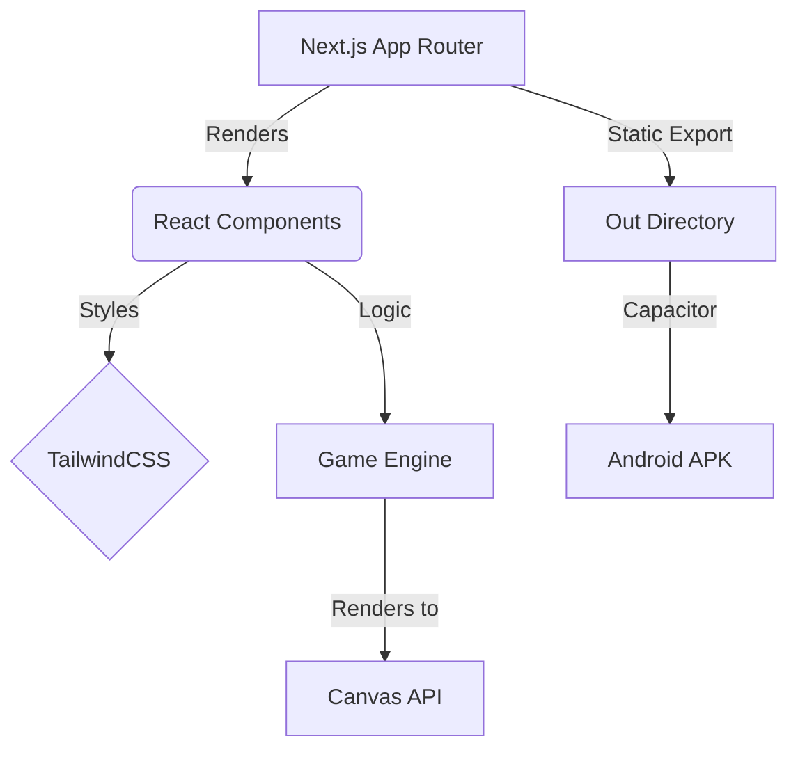

<div align="center">
  

  <br />
  
  [](https://nextjs.org/)
  [](https://reactjs.org/)
  [](https://tailwindcss.com/)
  [](https://capacitorjs.com/)

  <br />

  **[🕹️ Play Now](#) • [📦 Download APK](https://github.com/gdeon99/fm26/releases) • [🐛 Report Bug](https://github.com/gdeon99/fm26/issues)**
</div>

---

## ✨ Features

- 🎮 **Smooth Canvas Rendering:** High-performance fixed aspect-ratio canvas.
- 📱 **Cross-Platform:** Available as a Web App and Native Android APK.
- ⚡ **Next.js Powered:** Rebuilt on the latest Next.js 15+ App Router.
- 🎨 **Modern UI:** Styled entirely with TailwindCSS.

<br />

> [!TIP]
> **Pro Tip:** Play on fullscreen mode for the best gaming experience!

---

## 🚀 Getting Started

### Prerequisites

Ensure you have [Node.js](https://nodejs.org/) installed, then simply run:

```bash
# Install dependencies
npm install

# Start the development server
npm run dev
```

Visit `http://localhost:3000` to start playing!

---

## 🛠️ Tech Stack Architecture



---

## 📦 Android APK Build

We use **Capacitor** to compile the web app into a native Android APK.

1. Build the Next.js static files:
   ```bash
   npm run build
   ```
2. Sync with Android platform:
   ```bash
   npx cap sync
   ```
3. Open in Android Studio or build via Gradle!

> [!NOTE]
> Check the **[Releases](https://github.com/gdeon99/fm26/releases)** tab to download the latest `.apk` file directly!

<div align="center">
  <br />
  Made with ❤️ by <strong>Gdeon99</strong>
</div>
